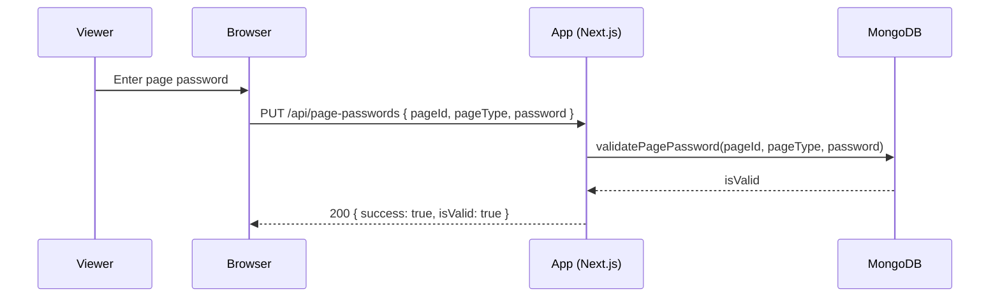

# AUTHENTICATION_AND_ACCESS.md

**Version:** 8.0.0  
**Last Updated:** 2025-10-19T13:44:58.000Z (UTC)
**Status:** Production

Zero-Trust Authentication and Page Access for MessMass

Quick Start (1-page)

Follow this minimal flow to enable zero-trust access on a single page in minutes:

1) Admin login (optional, bypasses page passwords)
- POST /api/admin/login with { email, password }.
- On success, an HttpOnly cookie admin-session is issued and used automatically.

2) Generate or retrieve the page password
- POST /api/page-passwords with { pageId, pageType } to receive { shareableLink, pagePassword }.
- Share shareableLink.url + pagePassword.password with the intended viewers.

3) Prompt the viewer for the password (if not an admin)
- Show a lightweight prompt. On submit, call PUT /api/page-passwords with { pageId, pageType, password }.
- If success: true and isValid: true, proceed to fetch page data.

```ts path=null start=null
// Minimal client prompt example
import { useState } from 'react'

export default function PasswordGate({ pageId, pageType }: { pageId: string, pageType: 'stats'|'edit'|'filter' }) {
  const [pwd, setPwd] = useState('')
  const [ok, setOk] = useState<boolean | null>(null)
  const [error, setError] = useState('')

  async function validate() {
    setError('')
    const res = await fetch('/api/page-passwords', {
      method: 'PUT',
      headers: { 'Content-Type': 'application/json' },
      body: JSON.stringify({ pageId, pageType, password: pwd })
    })
    const data = await res.json()
    if (res.ok && data.success && data.isValid) setOk(true)
    else setError(data?.error || 'Invalid password')
  }

  if (ok) return null // allow content to render when ok === true

  return (
    <div>
<input placeholder="Enter page password" value={pwd} onChange={(e) => setPwd(e.target.value)} />
      <button onClick={validate}>Unlock</button>
      {error && <p>{error}</p>}
    </div>
  )
}
```

4) Gate your content
- Server-first: check admin session via getAdminUser(). If present, allow immediately.
- If not admin, require a prior successful PUT /api/page-passwords call from the viewer UI to proceed (common pattern: render the prompt component until it returns ok=true).

5) Security considerations
- Use only server-side checks to decide access. Client code triggers validation but the server must enforce.
- HttpOnly cookie for admin-session ensures it's not readable by JS.
- All timestamps must use ISO 8601 with milliseconds Z format.
- **v6.22.3 Security Layers**: Page password authentication (`/api/page-passwords`) is protected by rate limiting but excluded from CSRF checks (authentication endpoints can't have CSRF tokens before auth).

Teammate Handoff Checklist
- Ensure .env.local contains required keys (MONGODB_URI, MONGODB_DB, NEXT_PUBLIC_WS_URL) and app builds (npm run build)
- Verify at least one admin user exists (email/password) in Users collection; confirm login via POST /api/admin/login
- For each protected page, generate a page password via POST /api/page-passwords { pageId, pageType }
- Share both the shareableLink.url and the password securely (do not paste secrets into chat tools without policy approval)
- In the UI, render the PasswordGate component at the top of protected content (components/PasswordGate.tsx)
- Confirm non-admin flow: prompt appears, password validates, content unlocks; confirm admin flow: content unlocks without the prompt
- Record operational notes and timestamps in ROADMAP/TASKLIST as needed; keep RELEASE_NOTES current with ISO timestamps

Overview
- Goal: Document the complete MessMass authentication model so fellow developers can implement, extend, and debug access control with confidence.
- Model: Zero-trust page access.
  - Admin users authenticate via a DB-backed session (HttpOnly cookie). 
  - Public pages (stats/edit/filter) can be guarded by page-specific passwords (random, MD5-style string).
  - When a single-page access is required, either an admin session OR the correct page password must be provided.

Core Concepts
- Admin Session (DB-backed):
  - Admins log in with email + password stored in the Users collection.
  - Successful login sets an HttpOnly cookie (admin-session) that encodes {token, expiresAt, userId, role} in base64 JSON.
  - Admin session bypasses page-password requirements on protected endpoints.
- Page-Specific Passwords (MD5-style):
  - Each page (stats|edit|filter) can have a randomly generated MD5-style token (32 hex chars) persisted in pagePasswords.
  - Shareable links are created along with the generated password.
  - Validation increases usage counters for auditability.
- Zero-Trust Rule:
  - Protected endpoints accept requests only when:
    1) An admin session is valid (admin-session cookie), OR 
    2) The provided page-specific password is valid for the requested page.

Data Model
- Users (MongoDB: users)
  - email, name, role ('admin' | 'super-admin'), password (plaintext-like MD5-style token per project rules), createdAt, updatedAt

```ts path=/Users/moldovancsaba/Projects/messmass/lib/users.ts start=11
export interface UserDoc {
  _id?: ObjectId
  email: string
  name: string
  role: UserRole
  password: string // plaintext-like token (MD5-style)
  createdAt: string // ISO 8601 with milliseconds
  updatedAt: string // ISO 8601 with milliseconds
}
```

- Page Passwords (MongoDB: pagePasswords)
  - pageId (slug), pageType ('stats'|'edit'|'filter'), password (32-hex), createdAt, optional expiresAt, usageCount, lastUsedAt


Admin Session: Login, Cookie, and Checks
- Login endpoint: POST /api/admin/login
  - Validates credentials against Users collection
  - Creates a base64 JSON session (7 days) and sets cookie 'admin-session' (HttpOnly, SameSite=Lax, Secure in production)

```ts path=/Users/moldovancsaba/Projects/messmass/app/api/admin/login/route.ts start=13
export async function POST(request: NextRequest) {
  try {
    const body = await request.json()
    const emailRaw = (body?.email || '').toString()
    const password = (body?.password || '').toString()

    if (!emailRaw || !password) {
      return NextResponse.json(
        { error: 'Email and password are required' },
        { status: 400 }
      )
    }

    const email = emailRaw.toLowerCase()

    // DB-backed user lookup; alias support for 'admin' => 'admin@messmass.com'
    let user = await findUserByEmail(email)
    if (!user && email === 'admin') {
      const alias = await findUserByEmail('admin@messmass.com')
      if (alias) user = alias
    }

    const isValid = !!(user && user.password === password)
    if (!isValid) {
      await new Promise((r) => setTimeout(r, 800))
      return NextResponse.json({ error: 'Invalid credentials' }, { status: 401 })
    }

    const token = crypto.randomBytes(32).toString('hex')
    const expiresAt = new Date(Date.now() + 7 * 24 * 60 * 60 * 1000)
    const tokenData = {
      token,
      expiresAt: expiresAt.toISOString(),
      userId: user?._id?.toString() || 'admin',
      role: (user?.role || 'super-admin') as 'admin' | 'super-admin'
    }
    const signedToken = Buffer.from(JSON.stringify(tokenData)).toString('base64')

    const cookieStore = await cookies()
    cookieStore.set('admin-session', signedToken, {
      httpOnly: true,
      secure: env.get('NODE_ENV') === 'production',
      sameSite: 'lax',
      maxAge: 7 * 24 * 60 * 60,
      path: '/'
    })

    return NextResponse.json({ success: true, token: signedToken, message: 'Login successful' })
  } catch (error) {
    return NextResponse.json({ error: 'Internal server error' }, { status: 500 })
  }
}
```

- Logout: DELETE /api/admin/login

```ts path=/Users/moldovancsaba/Projects/messmass/app/api/admin/login/route.ts start=82
export async function DELETE() {
  try {
    const cookieStore = await cookies()
    cookieStore.delete('admin-session')
    return NextResponse.json({ success: true, message: 'Logged out successfully' })
  } catch (error) {
    return NextResponse.json({ error: 'Logout failed' }, { status: 500 })
  }
}
```

- Server-side auth helpers: lib/auth.ts
  - decodeSessionToken() base64→JSON, expiry check
  - getAdminUser() resolves AdminUser from cookie
  - hasPermission() convenience check

```ts path=/Users/moldovancsaba/Projects/messmass/lib/auth.ts start=21
function decodeSessionToken(sessionToken: string): { token: string; expiresAt: string; userId: string; role: 'admin' | 'super-admin' } | null {
  try {
    const json = Buffer.from(sessionToken, 'base64').toString()
    const tokenData = JSON.parse(json)
    if (!tokenData?.token || !tokenData?.expiresAt || !tokenData?.userId || !tokenData?.role) return null
    const expiresAt = new Date(tokenData.expiresAt)
    const now = new Date()
    if (now > expiresAt) return null
    return tokenData
  } catch {
    return null
  }
}
```

```ts path=/Users/moldovancsaba/Projects/messmass/lib/auth.ts start=40
export async function getAdminUser(): Promise<AdminUser | null> {
  const cookieStore = await cookies()
  const adminSession = cookieStore.get('admin-session')
  if (!adminSession?.value) return null

  const tokenData = decodeSessionToken(adminSession.value)
  if (!tokenData) return null

  const user = await findUserById(tokenData.userId)
  if (!user) return null

  const basePermissions = ['read', 'write', 'delete', 'manage-users']
  const permissions = user.role === 'super-admin' ? basePermissions : basePermissions

  return {
    id: user._id!.toString(),
    name: user.name,
    email: user.email,
    role: user.role,
    permissions
  }
}
```

- Client/server check: GET /api/auth/check

```ts path=/Users/moldovancsaba/Projects/messmass/app/api/auth/check/route.ts start=1
import { NextRequest, NextResponse } from 'next/server';
import { getAdminUser } from '@/lib/auth';

export async function GET(request: NextRequest) {
  try {
    const user = await getAdminUser();
    if (!user) {
      return NextResponse.json({ authenticated: false, user: null });
    }
    return NextResponse.json({ authenticated: true, user: { name: user.name, role: user.role } });
  } catch (error) {
    return NextResponse.json({ authenticated: false, user: null });
  }
}
```

Page-Specific Passwords (Per-Page Access)
- Runtime requirement (Node): app/api/page-passwords uses Node crypto; route opts into Node runtime.

```ts path=/Users/moldovancsaba/Projects/messmass/app/api/page-passwords/route.ts start=13
export const runtime = 'nodejs';
```

- Password generation (MD5-style), persistence, and usage tracking

```ts path=/Users/moldovancsaba/Projects/messmass/lib/pagePassword.ts start=37
export function generateMD5StylePassword(): string {
  // 32-char lowercase hex string that "looks like" MD5
  return randomBytes(16).toString('hex');
}
```

- Retrieve or create a page password and produce a shareable link

```ts path=/Users/moldovancsaba/Projects/messmass/app/api/page-passwords/route.ts start=15
export async function POST(request: NextRequest) {
  const body = await request.json();
  const { pageId, pageType, regenerate = false } = body;
  const pagePassword = await getOrCreatePagePassword(pageId, pageType as PageType, regenerate);
  const protocol = request.headers.get('x-forwarded-proto') || 'https';
  const host = request.headers.get('host') || request.headers.get('x-forwarded-host') || 'localhost:3000';
  const baseUrl = `${protocol}://${host}`;
  const shareableLink = await generateShareableLink(pageId, pageType as PageType, baseUrl);
  return NextResponse.json({ success: true, shareableLink, pagePassword: { pageId: pagePassword.pageId, pageType: pagePassword.pageType, password: pagePassword.password, createdAt: pagePassword.createdAt, usageCount: pagePassword.usageCount } });
}
```

- Validate password (Admin bypass)

```ts path=/Users/moldovancsaba/Projects/messmass/app/api/page-passwords/route.ts start=74
export async function PUT(request: NextRequest) {
  const body = await request.json();
  const { pageId, pageType, password } = body;

  // Admin bypass via session
  const admin = await getAdminUser()
  if (admin) {
    return NextResponse.json({ success: true, isValid: true, isAdmin: true, message: 'Admin session accepted' })
  }

  const validation = await validateAnyPassword(pageId, pageType as PageType, password);
  if (validation.isValid) {
    return NextResponse.json({ success: true, isValid: true, isAdmin: validation.isAdmin, message: validation.isAdmin ? 'Admin password accepted' : 'Page password accepted' });
  } else {
    return NextResponse.json({ success: false, isValid: false, isAdmin: false, error: 'Invalid password' }, { status: 401 });
  }
}
```

- Validate-only function for page passwords

```ts path=/Users/moldovancsaba/Projects/messmass/lib/pagePassword.ts start=178
export async function validateAnyPassword(
  pageId: string,
  pageType: PageType,
  providedPassword: string
): Promise<{ isValid: boolean, isAdmin: boolean }> {
  const isPagePasswordValid = await validatePagePassword(pageId, pageType, providedPassword);
  return { isValid: isPagePasswordValid, isAdmin: false };
}
```

Users Collection and Admin Passwords
- All admin users are stored in users with an MD5-style token in password (per project conventions).
- Creation / updates are done via library helpers or admin UI.

```ts path=/Users/moldovancsaba/Projects/messmass/lib/users.ts start=21
export async function getUsersCollection() {
  const db = await getDb()
  const col = db.collection<UserDoc>('users')
  try { await col.createIndex({ email: 1 }, { unique: true }) } catch {}
  return col
}
```

```ts path=/Users/moldovancsaba/Projects/messmass/lib/users.ts start=61
export async function createUser(user: Omit<UserDoc, '_id'>): Promise<UserDoc> {
  const col = await getUsersCollection()
  const now = new Date().toISOString()
  const doc: Omit<UserDoc, '_id'> = { ...user, email: user.email.toLowerCase(), createdAt: user.createdAt || now, updatedAt: user.updatedAt || now }
  const res = await col.insertOne(doc)
  return { _id: res.insertedId, ...doc }
}
```

```ts path=/Users/moldovancsaba/Projects/messmass/lib/users.ts start=78
export async function updateUserPassword(id: string, password: string): Promise<UserDoc | null> {
  const col = await getUsersCollection()
  if (!ObjectId.isValid(id)) return null
  const now = new Date().toISOString()
  await col.updateOne({ _id: new ObjectId(id) }, { $set: { password, updatedAt: now } })
  return findUserById(id)
}
```

Implementation Scenarios

Scenario A — Gate an entire page (client prompt + server enforcement)
- Client: Render PasswordGate until it resolves ok=true. In parallel, the server loads the page shell normally.
- Server: API endpoints that serve sensitive data must call getAdminUser(); if null, reject unless validated via the password endpoint first.

```ts path=null start=null
// Example: page component
// 1) Render gate UI above content
// 2) Fetch actual data after gate resolution
function StatsPage({ slug }: { slug: string }) {
  // show admin banner by checking /api/auth/check (optional)
  // and gate content with PasswordGate until ok === true
  return (
    <div>
      <PasswordGate pageId={slug} pageType="stats" />
      {/* Once gate resolves on client, fetch stats normally via /api/projects/stats/[slug] */}
      {/* Server must still enforce admin-or-password validation in the API route. */}
    </div>
  )
}
```

Scenario B — Gate a section within a page
- Show non-sensitive elements freely.
- Wrap sensitive sub-sections with PasswordGate and render them only when ok === true.

```ts path=null start=null
function MixedContent({ slug }: { slug: string }) {
  return (
    <div>
      <h2>Public Summary</h2>
      <p>High-level info that is safe to show.</p>

      <PasswordGate pageId={slug} pageType="stats" />
      {/* Sensitive charts below appear only after gate validation */}
      <div>
        <h3>Detailed Charts</h3>
        {/* charts */}
      </div>
    </div>
  )
}
```

Scenario C — Gate an API route (server-only)
- First check admin session.
- If not admin, require a valid page password accompanying the request (e.g., in JSON body), then validate via validateAnyPassword().

```ts path=null start=null
// Pseudocode for an API route handler
import { getAdminUser } from '@/lib/auth'
import { validateAnyPassword } from '@/lib/pagePassword'

export async function POST(request) {
  const admin = await getAdminUser()
  if (admin) return ok()

  const { pageId, pageType, password } = await request.json()
  const { isValid } = await validateAnyPassword(pageId, pageType, password)
  if (!isValid) return unauthorized()

  return ok()
}
```

Scenario D — Generate a shareable link for a teammate
- Use POST /api/page-passwords to receive { shareableLink, pagePassword }.
- Send both values out-of-band. Receivers use the password on first access via the prompt.

```ts path=null start=null
async function createShare(slug) {
  const res = await fetch('/api/page-passwords', {
    method: 'POST', headers: { 'Content-Type': 'application/json' },
    body: JSON.stringify({ pageId: slug, pageType: 'stats' })
  })
  const { shareableLink, pagePassword } = await res.json()
  // shareableLink.url and pagePassword.password
}
```

Access Control Flows (Zero-Trust)
1) Admin Access Flow
   - Client: POST /api/admin/login { email, password }
   - Server: Set HttpOnly cookie 'admin-session' (7 days)
   - Check: GET /api/auth/check to verify session
   - Result: Admin session bypasses page password checks on protected endpoints

2) Page Password Access Flow (stats/edit/filter)
   - Server: POST /api/page-passwords { pageId, pageType } → returns password + shareable URL
   - Client: Provide password with PUT /api/page-passwords { pageId, pageType, password }
   - Server: If admin session present → accept; else validate page password

3) Combined (Zero-Trust) Rule
   - Protected endpoints must check admin session first
   - If absent, require page-specific password
   - Never trust client-only checks; always validate on the server

Usage Examples
- Generate a shareable link for stats page

```ts path=null start=null
const res = await fetch('/api/page-passwords', {
  method: 'POST',
  headers: { 'Content-Type': 'application/json' },
  body: JSON.stringify({ pageId: 'my-event-slug', pageType: 'stats' })
})
const { shareableLink, pagePassword } = await res.json()
console.log('Visit:', shareableLink.url, 'Password:', pagePassword.password)
```

- Validate access for a stats page (client)

```ts path=null start=null
const res = await fetch('/api/page-passwords', {
  method: 'PUT',
  headers: { 'Content-Type': 'application/json' },
  body: JSON.stringify({ pageId: 'my-event-slug', pageType: 'stats', password: inputPassword })
})
const data = await res.json()
if (data.success && data.isValid) {
  // proceed to fetch stats
}
```

Operational Policies and Security Notes
- Cookies: HttpOnly, SameSite=Lax, Secure in production
- Timestamps: Always ISO 8601 with milliseconds (UTC)
- Secrets: Never commit .env.local; only NEXT_PUBLIC_* keys are allowed client-side
- Admin Passwords: Store as MD5-style random tokens (project policy); re-generate via randomBytes(16) when needed
- Page Passwords: May set optional expiresAt and track usageCount/lastUsedAt for operational oversight
- Auditing: Use getPasswordStats() for quick insight into usage

Diagrams

Admin Login Flow
```mermaid path=null start=null
sequenceDiagram
  participant U as User (Admin)
  participant B as Browser
  participant A as App (Next.js)
  participant DB as MongoDB

  U->>B: Enter email + password
  B->>A: POST /api/admin/login { email, password }
  A->>DB: findUserByEmail(email)
  DB-->>A: user
  A-->>B: Set-Cookie: admin-session=...; HttpOnly; SameSite=Lax; Secure
```

Page Password Validation Flow


Zero-Trust Combined (Admin or Password)
```mermaid path=null start=null
flowchart TD
  A[Request to Protected Resource]
  B{getAdminUser()?}
  C{validateAnyPassword()?}
  A --> B
  B -- yes --> D[Allow]
  B -- no --> C
  C -- true --> D[Allow]
  C -- false --> E[Reject]
```

Server-side Gate Helpers

API Route Helper (admin or page password)
```ts path=null start=null
import { NextRequest, NextResponse } from 'next/server'
import { getAdminUser } from '@/lib/auth'
import { validateAnyPassword } from '@/lib/pagePassword'

export async function POST(request: NextRequest) {
  const admin = await getAdminUser()
  if (admin) return NextResponse.json({ success: true, message: 'Admin session accepted' })

  const { pageId, pageType, password } = await request.json()
  const { isValid } = await validateAnyPassword(pageId, pageType, password)
  if (!isValid) return NextResponse.json({ success: false, error: 'Unauthorized' }, { status: 401 })

  return NextResponse.json({ success: true })
}
```

SSR Page Example (server component)
```ts path=null start=null
// app/protected/[slug]/page.tsx (server component)
import PasswordGate from '@/components/PasswordGate'

export default async function ProtectedPage({ params }: { params: { slug: string } }) {
  // Server-side data fetching can be guarded by admin session in APIs.
  // The UI layer uses PasswordGate to prompt non-admin viewers.
  const pageId = params.slug
  const pageType = 'stats' as const

  return (
    <div className="page-container content-surface">
      <h1>Protected {pageId}</h1>
      <PasswordGate pageId={pageId} pageType={pageType}>
        {/* Sensitive content goes here */}
        <div className="glass-card content-surface">Unlocked content for {pageId}</div>
      </PasswordGate>
    </div>
  )
}
```

Appendix: Quick References
- Check admin session in server code

```ts path=/Users/moldovancsaba/Projects/messmass/lib/auth.ts start=68
export async function isAuthenticated(): Promise<boolean> {
  const user = await getAdminUser()
  return user !== null
}
```

- Node runtime declaration (for password generation route)

```ts path=/Users/moldovancsaba/Projects/messmass/app/api/page-passwords/route.ts start=13
export const runtime = 'nodejs';
```

---

## Security Layers & Employee Access (v6.22.3)

### Overview

MessMass implements three security layers to protect against attacks while enabling employee access:

1. **Rate Limiting** - Prevents brute-force attacks and DDoS
2. **CSRF Protection** - Prevents cross-site request forgery
3. **Authentication** - Admin sessions + Page-specific passwords

### Employee Access Flow

**Use Case**: Share stats/edit/filter pages with employees using unique passwords

**Generation** (Admin):
```typescript
// POST /api/page-passwords
{
  "pageId": "my-event-slug",
  "pageType": "stats"
}

// Response
{
  "shareableLink": {
    "url": "https://messmass.com/stats/my-event-slug",
    "password": "a1b2c3d4e5f6..."
  }
}
```

**Usage** (Employee):
1. Visit the shareable URL
2. Enter the provided password
3. System validates via `PUT /api/page-passwords`
4. Access granted for 24 hours (session storage)

### Security Layer Integration

**Authentication Endpoints** (`/api/admin/login`, `/api/page-passwords`):
- ✅ **Rate Limiting**: Applied (5 requests/15 minutes for auth)
- ❌ **CSRF Protection**: Excluded (can't have CSRF token before authentication)
- ✅ **Logging**: Request lifecycle and failures logged

**Rationale**: Authentication endpoints represent a "chicken-and-egg" problem:
- CSRF tokens require an established session
- Authentication endpoints CREATE the session
- Therefore, they must be excluded from CSRF checks
- Rate limiting provides DDoS protection instead

### CSRF Exclusion List

```typescript
// lib/csrf.ts
const authEndpoints = [
  '/api/admin/login',       // Admin authentication
  '/api/page-passwords',    // Page-specific password authentication (employees)
];

if (authEndpoints.includes(request.nextUrl.pathname)) {
  return null; // Skip CSRF check
}
```

### Employee Access Troubleshooting

**Issue**: Employee receives "Invalid CSRF token" error

**Cause**: `/api/page-passwords` was incorrectly included in CSRF protection (fixed in v6.22.3)

**Solution**: 
- ✅ Fixed in v6.22.3 - employees can now use generated passwords
- No action required

**Issue**: Employee receives "Rate limit exceeded"

**Cause**: Too many failed password attempts (5 attempts per 15 minutes)

**Solution**:
- Wait 15 minutes for rate limit reset
- Verify correct password was shared
- Check for typos or copy-paste errors

**Issue**: Password works for admin but not for employee

**Cause**: Admin session bypasses page password validation

**Solution**:
- Test employee access in incognito/private browsing (no admin session)
- Verify password was generated correctly via `POST /api/page-passwords`
- Check that `pageId` and `pageType` match between generation and validation

### Security Best Practices

**For Admins**:
1. Generate unique passwords per page/event
2. Regenerate passwords if compromised (`regenerate: true`)
3. Share passwords via secure channels (not public chat/email)
4. Monitor password usage via `usageCount` and `lastUsedAt`
5. Set expiration dates for temporary access (`expiresAt`)

**For Employees**:
1. Keep passwords confidential
2. Do not share passwords with unauthorized users
3. Clear browser session storage when done (`sessionStorage.clear()`)
4. Report access issues immediately
5. Use provided URL exactly as shared (don't modify)

### Monitoring & Auditing

**Password Statistics**:
```typescript
import { getPasswordStats } from '@/lib/pagePassword';

// Get stats for specific page
const stats = await getPasswordStats('my-event-slug');
// { total: 5, used: 3, neverUsed: 2, mostUsed: {...} }

// Get global stats
const globalStats = await getPasswordStats();
```

**Logs** (v6.22.3):
```json
{
  "level": "INFO",
  "message": "Request completed",
  "method": "PUT",
  "pathname": "/api/page-passwords",
  "ip": "192.168.1.100",
  "duration": 45,
  "status": 200,
  "timestamp": "2025-10-18T10:28:00.000Z"
}
```

### Performance Impact

**Employee Access** (typical flow):
1. Visit page: ~150ms (first-time CSRF token setup)
2. Enter password: ~50ms (password validation + rate limit check)
3. Load content: ~100ms (normal page load)

**Total**: ~300ms first-time, ~150ms subsequent visits

**Overhead from Security Layers**:
- Rate limiting: +2ms per request
- CSRF validation: +1ms per request (excluded for auth endpoints)
- Logging: +1ms per request

**Total Security Overhead**: ~4ms (negligible)

### Migration Notes (v6.22.3)

**Breaking Change**: None

**New Feature**: Page password authentication now works correctly with security layers

**Action Required**: None - existing passwords continue to work

**Verification**:
```bash
# Test employee access
curl -X PUT http://localhost:3000/api/page-passwords \
  -H "Content-Type: application/json" \
  -d '{
    "pageId": "test-event",
    "pageType": "stats",
    "password": "generated-password-here"
  }'

# Expected: 200 OK with { success: true, isValid: true }
```

---

**Document Version**: 6.22.3  
**Last Updated**: 2025-10-18T10:28:00.000Z (UTC)  
**Status**: Production - Security Layers Active
